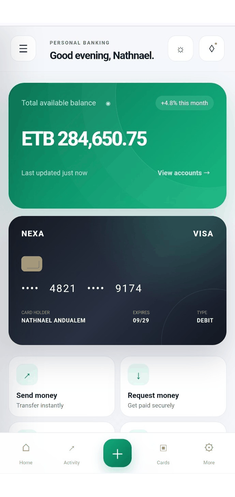
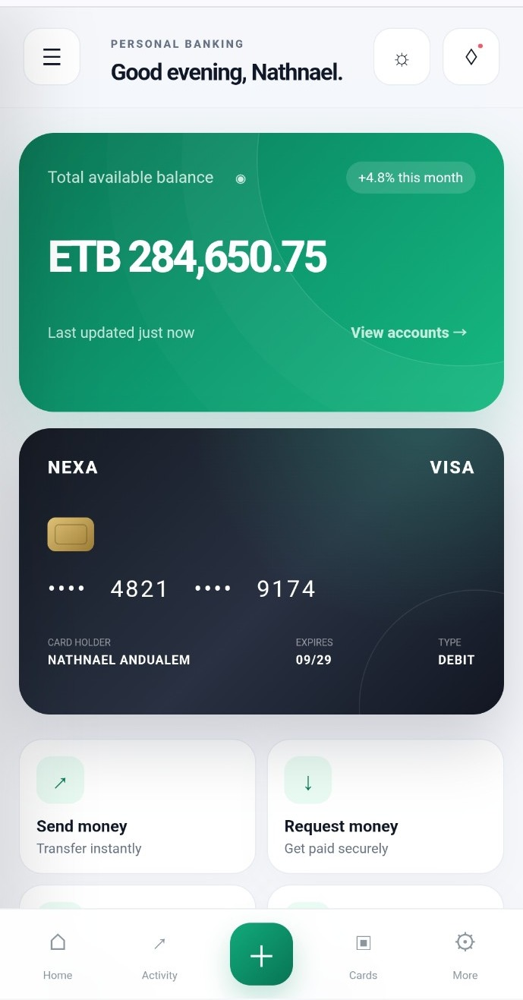
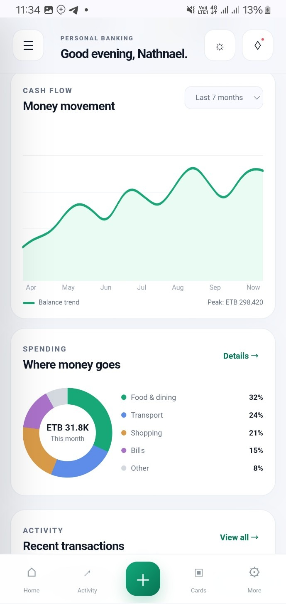

# 🏦 NexaBank

### A modern digital banking dashboard built with HTML, CSS & JavaScript.

<p align="center">
  
</p>

<p align="center">
  <a href="https://graviton25.github.io/NexaBank/"><strong>🚀 Live Demo</strong></a>
  &nbsp;&nbsp;•&nbsp;&nbsp;
  <a href="https://github.com/Graviton25/NexaBank"><strong>💻 Source Code</strong></a>
</p>

---

## ✨ Overview

NexaBank is a modern, responsive banking dashboard built as a frontend learning and portfolio project. It focuses on a polished fintech-style interface, responsive layouts, interactive dashboard components, financial visualizations, and a mobile-friendly experience.

## 📸 Preview

### Mobile Dashboard

<p align="center">
  
</p>

### Cash Flow & Spending

<p align="center">
  
</p>

---

## 🚀 Features

| Feature | Description |
|---|---|
| 💳 Virtual Card | Modern digital banking card interface |
| 💰 Balance Overview | Account balance and financial summary |
| 📊 Cash Flow | Visual income and spending overview |
| 📈 Spending Analytics | Spending category breakdown |
| 🎯 Savings Goal | Savings progress interface |
| 💸 Transfers | Money transfer interface |
| 👥 Recipients | Saved recipient management |
| 🔎 Transactions | Search and filter transactions |
| 📥 CSV Export | Export transaction information |
| 🔔 Notifications | Interactive notification center |
| 🌙 Dark Mode | Light and dark themes |
| 📱 Responsive UI | Mobile, tablet, and desktop layouts |
| ⚡ Quick Actions | Fast access to common actions |

## 🛠️ Technologies

- HTML5
- CSS3
- JavaScript
- SVG
- Git & GitHub
- GitHub Pages

## 📂 Project Structure

```text
NexaBank/
│
├── assets/
│   ├── nexabank-demo.gif
│   ├── dashboard-mobile.jpg
│   └── analytics-mobile.jpg
│
├── index.html
├── style.css
├── script.js
├── README.md
└── .gitignore
```

## 🌐 Live Demo

**https://graviton25.github.io/NexaBank/**

## ⚡ Getting Started

Clone the repository:

```bash
git clone https://github.com/Graviton25/NexaBank.git
cd NexaBank
```

Open `index.html` in your browser, or use VS Code Live Server.

## 🔮 Future Development

- User authentication
- Backend API
- Database integration
- Secure authorization
- Persistent transaction history
- Real-time notifications
- Two-factor authentication
- Advanced financial analytics
- Secure API communication

## ⚠️ Disclaimer

NexaBank is a frontend learning and portfolio project. It is not connected to a real bank, financial institution, payment provider, or real banking accounts. The financial data and interactions shown are for demonstration purposes.

A production banking application would require secure backend infrastructure, authentication, encryption, authorization, database systems, financial integrations, security testing, audit logging, and appropriate regulatory compliance.

## 👨‍💻 Author

**Nathnael Andualem**

Civil Engineering Student @ AASTU | Aspiring Software Developer

GitHub: https://github.com/Graviton25

---

<p align="center">⭐ If you like the project, consider giving it a star!</p>
